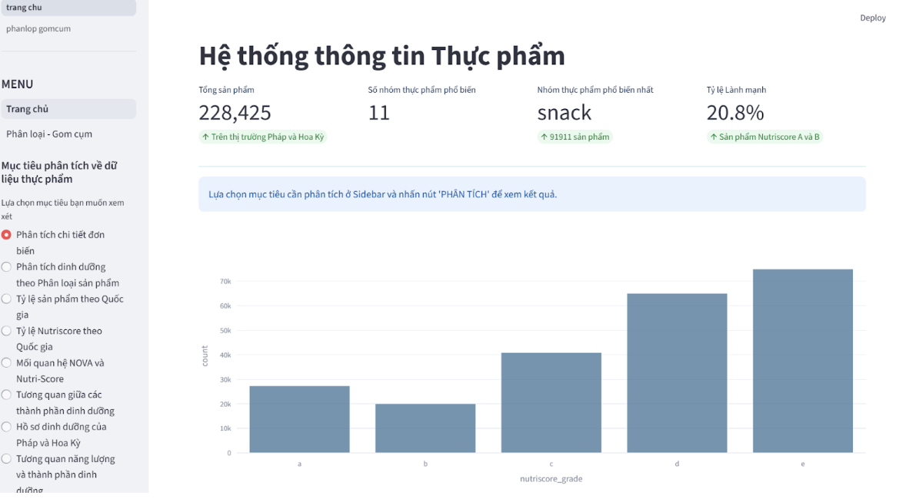
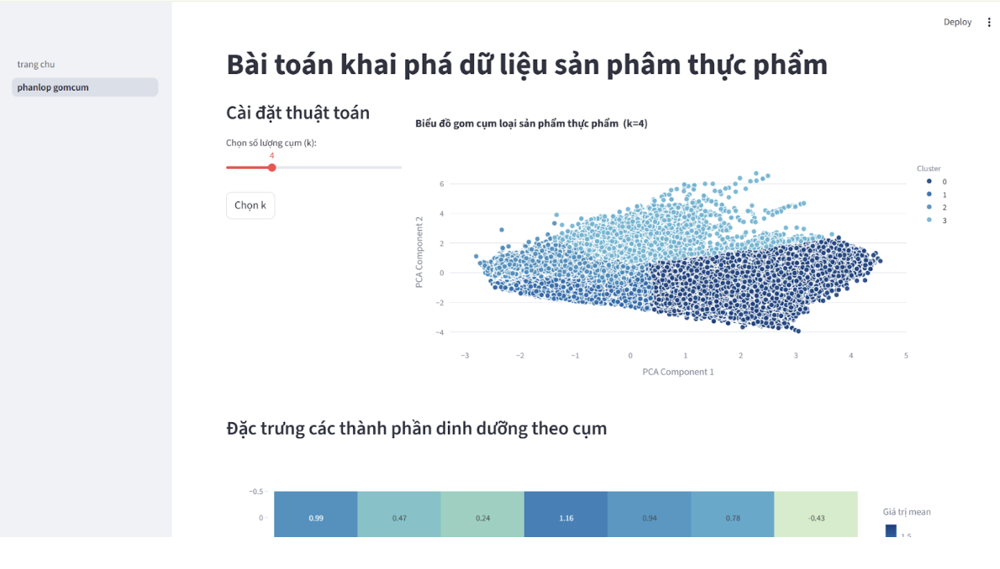

# ANAYLYZING NUTRITIONS OF FOOD ON OPEN FOOD FATCS

## Introduction
This project analyze the nutriences among food by crawling data from OFF (Open Food Facts - an open web for users to post and upgrade related information of differents food consumed in reality.)

The data was downloaded from OFF on 2nd November 2025 and analyzed. The data uploaded to the web after that time is not used in this project.

The data is analyzed to use for three main goal:
- EDA (find out how nutriences distributed in each type of food to define what food category is better to be consumed as well as avoided.)
- Supervised Learning - using model (DecisionTree, RandomForest, XGBoost) to label Nutriscore and NutriRank to new type of food based on the information on the package provided by consumers in order to give users a clear recognition of that product to stay healthy by using it in the right way.
- Unsupervised learning (KMeans) - define whether the information of nutriences on the package is reliable and the current trend of nutrient distribution in a food product on the market.
- Association Rules (FP-Growth) - define how the way the product is produced related to its nutriences and how the distribution of nutriences relevant to its NutriScore -> provide knowledge to customers.

## Dataset
Data Source: Open Food Facts

Website: [https://world.openfoodfacts.org/]
Dữ liệu bao gồm:
Create folder csv/ and download df_final (1).csv

Drive: Bộ dữ liệu Open Food Facts [https://drive.google.com/drive/folders/1tcjd1UQjF6lB7EnyTZVZtTA2m6_z1Os-?usp=sharing]

## Demo

## Analyze
1. Data Visualization
- Clear dominance of ultra-processed foods (NOVA 4), reflecting the packaged food market.
- Skewed distributions in fat_100g and energy_100g, with many outliers.
- Baby food stands out as safer, minimally processed (NOVA 1), unlike snacks or drinks.
2. Classification Models
- Built models to predict NutriScore and NOVA group.
- Random Forest performed best:
- NutriScore accuracy: 85%, with strong F1-scores for extreme labels (E=0.92, D=0.87).
- Binary classification (Healthy vs. Unhealthy): 94% accuracy.
- Key features: energy_100g, sugars_100g.
- NOVA prediction accuracy: 86%, but confusion remains between intermediate groups and NOVA 4.
3. Clustering
- K-Means (k=4), Silhouette Score = 0.412.
- Clusters identified:
- High energy & sugar (sweets/snacks).
- Low nutrition (drinks, watery vegetables).
- High protein (lean meat, fitness foods).
- High fat & protein (cheese, processed red meat).
4. Association Rules
- Using FP-Growth (min_support=0.02):
- Food trap: Snack + Ultra-processed + Additives → NutriScore E (confidence 73.5%, lift 2.24).
- Paradox: Meat/Fish in NOVA 4 still often achieve NutriScore A due to high protein, low sugar (lift 4.06).

## Download Project
Due to the limitation of upload file size on Github, this folder cannot upload the completed folder. Please click here to download: 
- final data source: [https://drive.google.com/drive/folders/1tcjd1UQjF6lB7EnyTZVZtTA2m6_z1Os-?usp=sharing] -- The main file using for the preprocess process is df_final (1).csv, the others are original source from OFF.
- models for labelling and clustering: [https://drive.google.com/drive/folders/12nRisvv17jOozLBJAxqiBHUJOYx_PwcN?usp=sharing] (classification) [https://drive.google.com/drive/folders/1n4aMRU1_fEg_WIxBhCIPMfEqaNxqPme_?usp=sharing] (clustering)

After download the required file (make sure all the files related to the project have been downloaded), following these steps to activate user interface:
1. Extracted the zip folder
2. Open the extracted folder in VS Code.
3. Run 'pip install -q -r requirements.txt' (download streamlit)
4. Run 'streamlit run trang_chu.py'
After entering the command, a local web page will be displayed.

